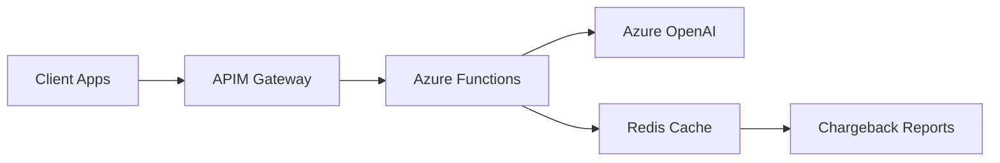
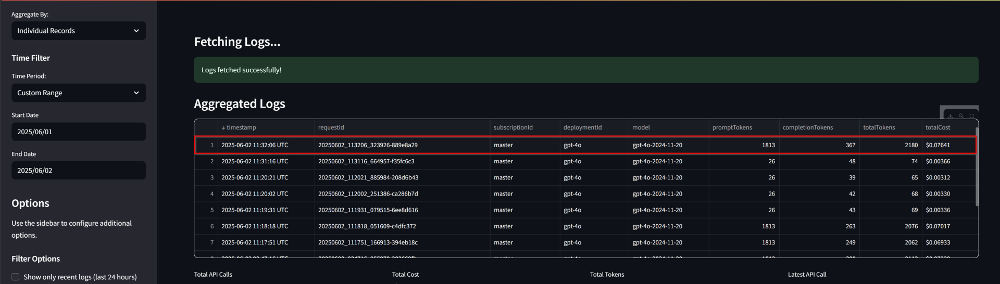

# Azure API Management OpenAI Chargeback Environment

[](https://opensource.org/licenses/MIT)
[](https://azure.microsoft.com)
[](https://openai.com)
[](https://docs.microsoft.com/azure/azure-resource-manager/bicep/)

## TL;DR
Enterprise-ready solution for OpenAI usage tracking and chargeback through Azure APIM. Solves the 8KB payload limit problem, provides real-time cost tracking, and includes comprehensive Infrastructure-as-Code deployment options.

**🚀 Quick Deploy**: `git clone → setup Python → deploy Bicep → configure policies`

**💰 What you get**: Real-time usage tracking, chargeback reports, scalable architecture, multi-IaC support

**🏗️ Tech Stack**: Azure Functions (Python), API Management, Redis Cache, Bicep/Terraform

## Quick Start

```bash
# 1. Clone and setup
git clone https://github.com/your-org/apim-openai-chargeback-environment.git
cd apim-openai-chargeback-environment

# 2. Setup Python environment
cd function-app && python -m venv venv && source venv/bin/activate
pip install -r requirements.txt

# 3. Deploy infrastructure (Bicep - recommended)
cd ../infrastructure/bicep
az deployment group create \
  --resource-group myResourceGroup \
  --template-file main.bicep \
  --parameters @parameters/dev.json

# 4. Deploy Function App
cd ../../function-app && func azure functionapp publish <function-app-name>

# 5. Done! 🎉
```

**⚡ Alternative deployment options**: [Terraform](docs/DEPLOYMENT_GUIDE.md#terraform) | [ARM Templates](docs/DEPLOYMENT_GUIDE.md#arm-templates) | [Pulumi](docs/DEPLOYMENT_GUIDE.md#pulumi)

## The Problem We Solve

| Challenge | Impact | Our Solution |
|-----------|--------|--------------|
| **APIM logs truncate at 8KB** | Large OpenAI payloads get cut off | ✅ Handle payloads up to 100MB |
| **No usage tracking** | Cost overruns, no chargeback | ✅ Real-time cost tracking & reports |
| **Manual deployment** | Inconsistent environments | ✅ Multiple IaC options (Bicep, Terraform) |
| **Security concerns** | Data persistence issues | ✅ Minimal retention, encryption at rest |

## Solution Overview



**Core Components**:
- 🔐 **API Management** - Gateway, auth, rate limiting
- ⚡ **Azure Functions (Python)** - Usage tracking, cost calculation
- 💾 **Redis Cache** - Temporary data storage
- 📊 **Chargeback Engine** - Real-time cost allocation

**📐 Need detailed architecture?** See our comprehensive [Architecture Guide](docs/ARCHITECTURE.md) with detailed component diagrams, data flows, and system design.

## Key Features

- 🚀 **Scalable**: Handles large payloads (>8192 bytes)
- 💰 **Cost Tracking**: Real-time usage monitoring and chargeback
- 🔒 **Secure**: Minimal data persistence, Azure AD integration
- 🏗️ **Multi-IaC**: Bicep (primary), Terraform, ARM templates, Pulumi
- 📈 **Enterprise Ready**: Multi-region, HA, comprehensive monitoring
- 🔄 **CI/CD Ready**: GitHub Actions, Azure DevOps pipelines

## Documentation

| Topic | Description | Link |
|-------|-------------|------|
| **Architecture** | Detailed system design and components | [📖 Architecture Guide](docs/ARCHITECTURE.md) |
| **Deployment** | Step-by-step deployment for all IaC tools | [🚀 Deployment Guide](docs/DEPLOYMENT_GUIDE.md) |
| **API Reference** | Complete API documentation | [📚 API Docs](docs/API_REFERENCE.md) |
| **Usage Examples** | Code examples in multiple languages | [💻 Usage Examples](docs/USAGE_EXAMPLES.md) |
| **Monitoring** | Dashboards, alerts, and troubleshooting | [📊 Monitoring Guide](docs/MONITORING.md) |
| **Security** | Security best practices and compliance | [🔒 Security Guide](docs/SECURITY.md) |
| **Contributing** | Development setup and guidelines | [🤝 Contributing](CONTRIBUTING.md) |

## Usage Examples

### Python (Recommended)
```python
import requests

response = requests.post(
    "https://your-apim.azure-api.net/api/v1/openai/chat/completions",
    headers={"Ocp-Apim-Subscription-Key": "your-key"},
    json={"model": "gpt-4", "messages": [{"role": "user", "content": "Hello!"}]}
)
```

### Other Languages
- **C# / .NET**: [View Example](docs/USAGE_EXAMPLES.md#csharp)
- **Node.js**: [View Example](docs/USAGE_EXAMPLES.md#nodejs)
- **PowerShell**: [View Example](docs/USAGE_EXAMPLES.md#powershell)
- **curl**: [View Example](docs/USAGE_EXAMPLES.md#curl)

## Chargeback Dashboard Preview



*Real-time usage tracking with detailed cost breakdown by user, model, and time period.*

## Prerequisites

- ✅ Azure subscription with appropriate permissions
- ✅ Azure CLI v2.50+ 
- ✅ Python 3.9+
- ✅ Azure Functions Core Tools v4.x
- ✅ Docker Desktop (for local testing)

**Optional**: Bicep CLI, Terraform, or ARM templates depending on your IaC preference

## Configuration

### Environment Variables
```bash
# Essential configuration
AZURE_OPENAI_ENDPOINT=https://your-openai.openai.azure.com/
REDIS_CONNECTION_STRING=your-redis-connection-string
APIM_SUBSCRIPTION_KEY=your-apim-subscription-key
```

**📋 Complete configuration guide**: [Configuration Reference](docs/CONFIGURATION.md)

## Repository Structure
```
├── infrastructure/           # IaC templates
│   ├── bicep/               # 🎯 Primary (recommended)
│   ├── terraform/           # Alternative
│   ├── arm/                 # Alternative  
│   └── pulumi/              # Alternative
├── function-app/            # Python Azure Functions
├── policies/                # APIM policies
├── scripts/                 # Deployment scripts
└── docs/                    # Detailed documentation
```

**📝 Note**: The app works as-is, but we're tidying up the structure. Work in progress! 🚧

## Deployment Options

| Method | Best For | Command |
|--------|----------|---------|
| **Bicep** ⭐ | Azure-native teams | `az deployment group create --template-file main.bicep` |
| **Terraform** | Multi-cloud or existing Terraform | `terraform apply -var-file="dev.tfvars"` |
| **ARM Templates** | Legacy Azure deployments | `az deployment group create --template-file azuredeploy.json` |
| **Pulumi** | Programming-first approach | `pulumi up` |

**🔗 Detailed deployment guides**: [All deployment methods](docs/DEPLOYMENT_GUIDE.md)

## FAQ

**❓ What's the max payload size?**
✅ Up to 100MB (vs 8KB APIM limit)

**❓ How long is data retained?**  
✅ 30 days by default (configurable)

**❓ Multi-region support?**
✅ Yes, built for HA and disaster recovery

**❓ Can I use .NET instead of Python?**
✅ Yes, Azure Functions support multiple runtimes

**📚 More questions**: [Complete FAQ](docs/FAQ.md)

## Monitoring & Alerts

- 📊 **Real-time dashboards** for usage, costs, and performance
- 🚨 **Automated alerts** for anomalies and thresholds  
- 📈 **Custom metrics** for business KPIs
- 🔍 **Detailed logging** for troubleshooting

**🔧 Setup guide**: [Monitoring Configuration](docs/MONITORING.md)

## Support & Community

- **📖 Documentation**: Comprehensive guides in `/docs/`
- **🐛 Issues**: [GitHub Issues](https://github.com/your-org/repo/issues)
- **💬 Discussions**: [GitHub Discussions](https://github.com/your-org/repo/discussions)
- **🏢 Enterprise**: Contact support team for professional services

## Roadmap

| Quarter | Features |
|---------|----------|
| **Q2 2025** | Multi-region deployment, advanced analytics |
| **Q3 2025** | ML-based cost optimization, enhanced reporting |
| **Q4 2025** | Additional AI service integrations |

## Contributing

We welcome contributions! See our [Contributing Guide](CONTRIBUTING.md) for:
- 🛠️ Development setup
- 🧪 Testing guidelines  
- 📋 Code standards
- 🔄 PR process

## License

MIT License - see [LICENSE](LICENSE) for details.

---

**🎯 Ready to get started?** Follow the [Quick Start](#quick-start) above or dive into the [Deployment Guide](docs/DEPLOYMENT_GUIDE.md).

**💡 Need help?** Check our [FAQ](docs/FAQ.md) or create an [issue](https://github.com/your-org/repo/issues).


