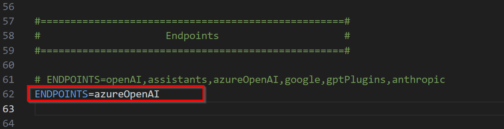
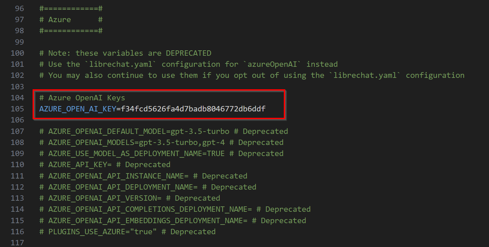
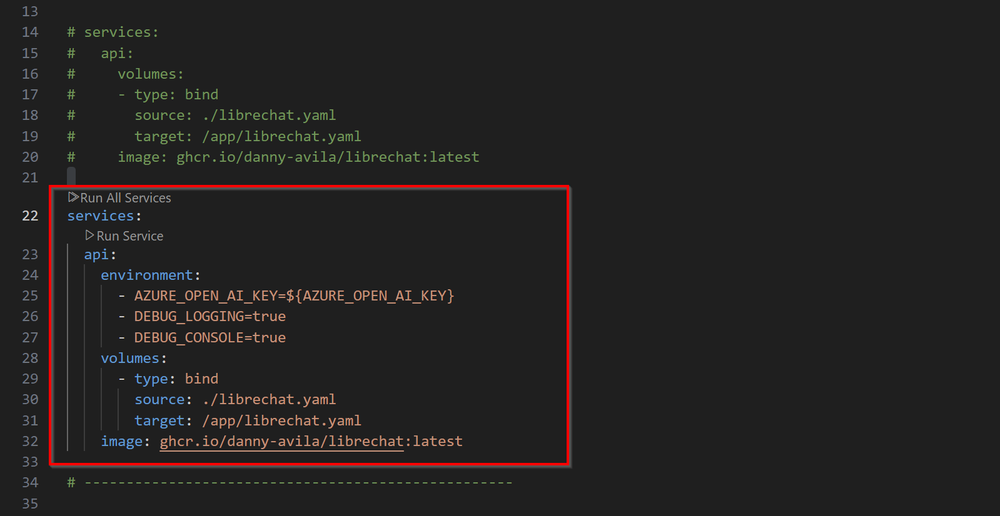
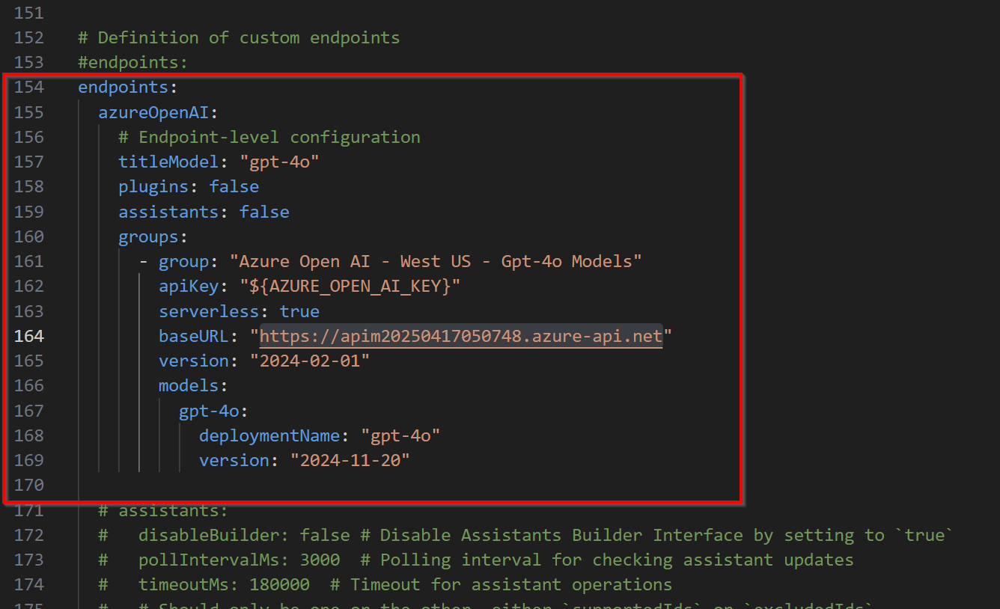

## Setting Up LibreChat with Azure OpenAI/APIM

This guide walks you through the process of setting up LibreChat with Azure OpenAI or APIM. In the case of the APIM, we masquerades Azure OpenAI endpoint with the APIM endpoint and the Azure OpenAI api-key with the APIM subscription key respectively.

### Prerequisites
Before proceeding, ensure you have the following:

1. **APIM or Azure OpenAI Service**
- The APIM and associated resources, including the Azure OpenAI instance needs to be set up first and configured before this chat UI can be configured.
- If you haven’t done this yet, refer to the [APIM Infrastructure README.md](../apim-infras/README.md).
2. **Docker Installed**
- LibreChat runs inside a Docker container. Install Docker from the [Docker website](https://www.docker.com/get-started).
3. **API Key Management**
- You need an API key when using Azure OpenAI instance API key or the subscription key when using the APIM. However, since the latter is masquerading as the former, what matters is the value in itself. They key can be labeled anything, e.g., api-key, Ocp-Apim-Subscription-Key or anything at all, so long as the same key is in the header of the HTTP request to the APIM endpoint. But the value in our case should be the APIM subscription key.
- Retrieve this key from the Azure APIM portal or the OpenAI Instance portal if you are using the latter.

 
 

**Step-by-Step Guide to Installing and Configuring LibreChat**
1. ***Clone the LibreChat Repository***  
Pull the LibreChat repository from GitHub and navigate into its directory:

  -  ` git clone https://github.com/danny-avila/LibreChat.git`
  -  `cd LibreChat `

2. ***Copy Configuration Files***  
Create default configuration files by running the following commands:

  -  ` cp .env.example .env `  
  -  ` cp docker-compose.override.yml.example docker-compose.override.yml `
     
  -  ` cp librechat.example.yaml librechat.yaml `

3. ***Configure the .env File***  
Set the ENDPOINTS field in the .env file to azureOpenAI to use Azure OpenAI as the backend. It should look like this: 

    
 
4. ***Set API Keys as Environment Variables***  
Add the APIM key or Azure OpenAI API keys as environment variables:
 
for Windows PC  

5. Update docker-compose.override.yml
Modify the docker-compose.override.yml file to include the environment variables and enable debug logging:

6. Configure librechat.yaml
Update the librechat.yaml file to define Azure OpenAI endpoints and model settings. Below is an example configuration:

NOTE: the version for the group and models are not required, but everything else is.  

### Running LibreChat
Start the LibreChat container using Docker:

`docker compose up -d`

Once the container is running, access LibreChat at http://localhost:3080.  

### References:
1. https://www.digital-reflections.com/blog/azure-openai-librechat-setup  
2. https://www.librechat.ai/docs/configuration/azure  
3. https://www.librechat.ai/docs/configuration/librechat_yaml/object_structure/azure_openai
